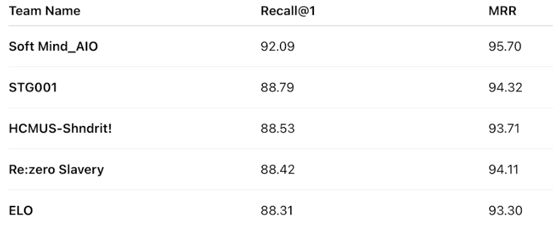

# ENTRep Challenge Track 2: Medical Image-to-Image Retrieval

[](https://aichallenge.hcmus.edu.vn/acm-mm-2025/entrep)
[](https://aichallenge.hcmus.edu.vn/acm-mm-2025/entrep)

<!-- Leaderboard image -->
<p align="center">
  
</p>

## Overview

This repository contains the implementation for **Track 2: Endoscopy Medical Images - Image-to-Image Retrieval** of the ENTRep Challenge, presented at ACM Multimedia 2025. Our solution, developed by **Team ELO**, achieved a **Top 5** placement on the private leaderboard.

## Abstract

The task is to develop a robust image-to-image retrieval system for endoscopic medical images. Our approach leverages state-of-the-art vision encoders, including **DINOv2** and **EndoViT**. We employ a contrastive learning strategy using the NT-Xent loss function to train the model, creating an effective embedding space for medical image analysis and retrieval.

## Table of Contents

- [Installation](#installation)
- [Dataset Structure](#dataset-structure)
- [Configuration](#configuration)
- [Usage](#usage)
- [Acknowledgments](#acknowledgments)
- [License](#license)
- [Contact](#contact)

## Installation

### Prerequisites

- Python 3.8+
- PyTorch 1.9+
- CUDA-compatible GPU (recommended)

### Dependencies

To install all required dependencies, run the following command:

```bash
pip install -r requirements.txt
```

## Dataset Structure

Please organize your data according to the following structure:

```
data/
└── processed/
    ├── train/
    │   ├── ear/
    │   ├── nose/
    │   ├── throat/
    │   └── vc/
    ├── val/
    │   ├── ear/
    │   └── ...
    └── test/
        ├── ear/
        └── ...
configs/
├── dinov2_vits14.yaml
├── dinov2_vitb14.yaml
├── dinov2_vitl14.yaml
└── ent-vit.yaml
outputs/
└── <wandb-run-name>/
    ├── best_model.pth
    └── ...
```

## Configuration

Configuration files in the `configs/` directory allow for customizing data, model, and training parameters.

Below is an example configuration for the `DINOv2-Base` model:

```yaml
# configs/dinov2_vitb14.yaml

# W&B configuration for experiment tracking
wandb:
  project: "Image_Retrieval_Experiments"
  entity: "hokhanhduy-none"
  run_name: "dinov2_vitb14_ntxent"

# Data configuration
data:
  path: "data/processed/"
  batch_size: 16
  num_workers: 4
  image_size: 224
  normalize: true

# Model configuration
model:
  backbone: "dino_v2"
  model_name: "dinov2_vitb14"
  feature_dim: 768
  num_classes: 7
  dropout: 0.1
  freeze_backbone: false

# Training configuration
training:
  strategy: "ntxent"
  epochs: 200
  optimizer: "AdamW"
  learning_rate: 0.00001
  weight_decay: 0.01
  scheduler: "cosine"
```

## Usage

### Training

To train a model with a specific configuration, run the following command:

```bash
python train.py --config configs/dinov2_vitb14.yaml
```

Available training configurations:

- `dinov2_vits14.yaml` - DINOv2 Small variant
- `dinov2_vitb14.yaml` - DINOv2 Base variant
- `dinov2_vitl14.yaml` - DINOv2 Large variant
- `ent-vit.yaml` - EndoViT specialized for endoscopic images

### Evaluation

To evaluate a trained model on the test set:

```bash
python eval.py --config configs/dinov2_vitb14.yaml --checkpoint outputs/<wandb-run-name>/best_model.pth --split test
```

The evaluation script will compute retrieval metrics including:

- HitRate@1, HitRate@5, HitRate@10
- MRR@1, MRR@5, MRR@10

## Acknowledgments

- ENTRep Challenge organizers for providing the dataset.
- ACM Multimedia 2025 for hosting the challenge.
- The authors of DINOv2 and EndoViT for their foundational work.

## License

This project is licensed under the MIT License - see the [LICENSE](LICENSE) file for details.

## Contact

For questions about this implementation, please open an issue or contact the team through the challenge platform.

-----

**Team ELO** | ENTRep Challenge 2025 | ACM Multimedia